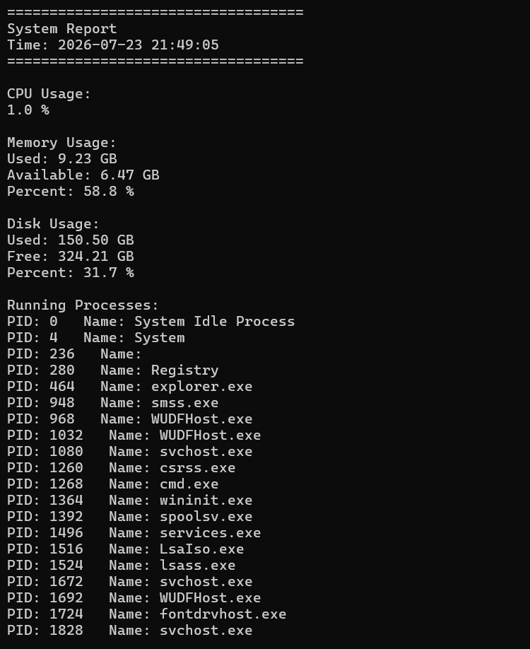

# 🖥️ Python System Monitor

A Python-based System Monitor built using the **psutil** library. This project monitors system resources such as CPU, memory, disk usage, and running processes, and saves the report to a log file.

## 🚀 Features

- Monitor CPU usage
- Monitor memory usage
- Monitor disk usage
- Display running processes
- Generate and save system reports to `system.log`

## 🛠️ Technologies Used

- Python 3
- psutil
- Git
- GitHub

## 📁 Project Structure

```
Linux-System-Monitor/
├── monitor.py
├── README.md
├── .gitignore
└── system.log   # Generated automatically when the program runs
```

## ⚙️ Installation

Clone the repository:

```bash
git clone https://github.com/REVATHIKUKKALA19/Linux-System-Monitor.git
```

Move into the project folder:

```bash
cd Linux-System-Monitor
```

Install the required package:

```bash
pip install psutil
```

## ▶️ Run the Project

```bash
python monitor.py
```

## 📋 Sample Output

```
===================================
System Report
Time: 2026-07-22 21:30:10
===================================

CPU Usage:
15.2%

Memory Usage:
46%

Disk Usage:
31.1%

Running Processes:
PID: 1200   chrome.exe
PID: 2500   python.exe
```
## Output Screenshot


## 📚 What I Learned

- Python programming fundamentals
- Using the `psutil` library for system monitoring
- File handling and logging
- Git version control
- GitHub repository management

## 👩‍💻 Author

**Revathi**

GitHub: https://github.com/REVATHIKUKKALA19
